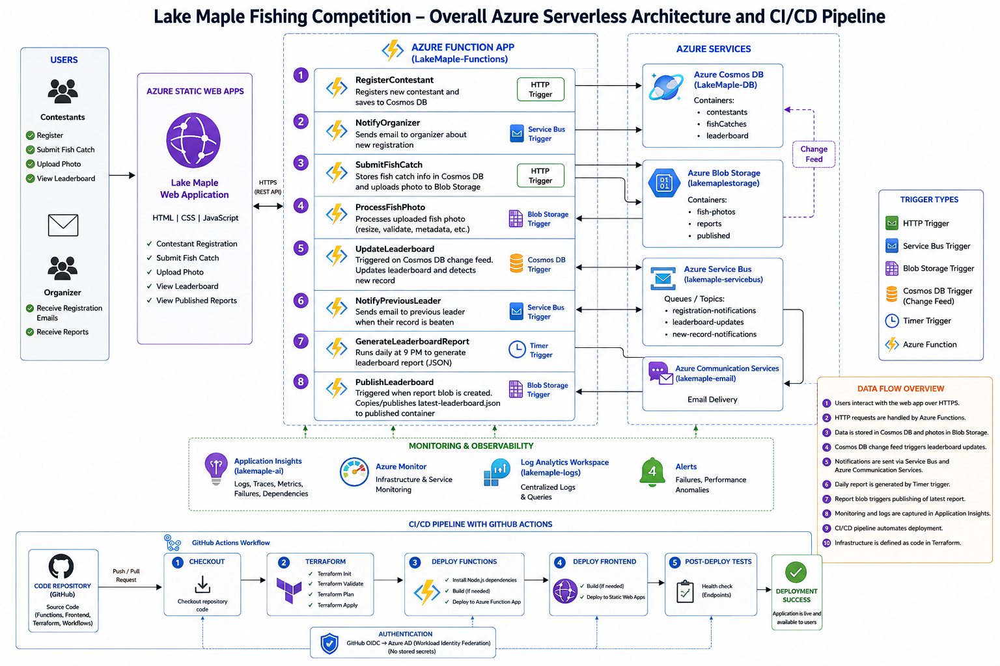

# Lake Maple Fishing Competition – Azure Serverless Application

A complete serverless fishing competition management system built on Microsoft Azure using Azure Functions, Cosmos DB, Blob Storage, Service Bus, Azure Communication Services, Static Web Apps, Terraform, and GitHub Actions.

This project demonstrates event-driven architecture, Infrastructure as Code, CI/CD, serverless application development, cloud monitoring, asynchronous messaging, and workload identity federation.

## Architecture Overview

The following diagram shows the complete Lake Maple serverless architecture,
including the application workflow, Azure services, monitoring, and CI/CD pipeline.



## Architecture Overview

The application allows contestants to:

- Register for the Lake Maple Fishing Competition
- Submit fish catches with fish type, weight, and photographic proof
- View the current leaderboard
- Receive notifications when their record is beaten

Organizers receive registration notifications and can access generated leaderboard reports.

The application uses multiple Azure Function trigger types:

| Function                    | Trigger      | Purpose                                          |
| --------------------------- | ------------ | ------------------------------------------------ |
| `RegisterContestant`        | HTTP         | Registers contestants                            |
| `NotifyOrganizer`           | Service Bus  | Sends organizer registration notifications       |
| `SubmitFishCatch`           | HTTP         | Saves catch data and uploads photos              |
| `ProcessFishPhoto`          | Blob Storage | Processes uploaded fish photographs              |
| `UpdateLeaderboard`         | Cosmos DB    | Updates standings from the Cosmos DB change feed |
| `NotifyPreviousLeader`      | Service Bus  | Notifies a displaced record holder               |
| `GenerateLeaderboardReport` | Timer        | Generates the nightly leaderboard report         |
| `PublishLeaderboard`        | Blob Storage | Publishes the generated leaderboard report       |
| `GetLeaderboard`            | HTTP         | Returns the current leaderboard to the frontend  |

## Azure Services Used

The solution uses:

- Azure Functions Runtime v4
- Node.js 22
- Azure Cosmos DB for NoSQL
- Azure Blob Storage
- Azure Service Bus
- Azure Communication Services Email
- Azure Static Web Apps
- Azure Application Insights
- Azure Monitor
- Log Analytics
- Terraform
- GitHub Actions
- Microsoft Entra ID workload identity federation using OIDC

## Project Structure

```text
lake-maple-serverless/
│
├── .github/
│   └── workflows/
│       └── deploy.yml
│
├── terraform/
│   ├── main.tf
│   ├── variables.tf
│   ├── outputs.tf
│   └── terraform.tfvars.example
│
├── functions/
│   ├── package.json
│   ├── host.json
│   ├── local.settings.json.example
│   │
│   └── src/
│       ├── functions/
│       │   ├── RegisterContestant.js
│       │   ├── NotifyOrganizer.js
│       │   ├── SubmitFishCatch.js
│       │   ├── ProcessFishPhoto.js
│       │   ├── UpdateLeaderboard.js
│       │   ├── NotifyPreviousLeader.js
│       │   ├── GenerateLeaderboardReport.js
│       │   ├── PublishLeaderboard.js
│       │   └── GetLeaderboard.js
│       │
│       └── services/
│           ├── cosmosClient.js
│           └── blobClient.js
│
├── frontend/
│   ├── index.html
│   ├── style.css
│   └── app.js
│
├── .gitignore
└── README.md
```

## Prerequisites

Before deploying the project, install the following tools:

- Git
- Node.js 22
- npm
- Azure CLI
- Azure Functions Core Tools v4
- Terraform
- An Azure subscription
- A GitHub account

Verify the installations:

```bash
node --version
npm --version
az --version
func --version
terraform version
git --version
```

## 1. Clone the Repository

```bash
git clone https://github.com/tech-codec/lake-maple-serverless.git
```

Then:

```bash
cd lake-maple-serverless
```

## 2. Sign In to Azure

```bash
az login
```

Check the active subscription:

```bash
az account show -o table
```

If necessary, select another subscription:

```bash
az account set --subscription "YOUR-SUBSCRIPTION-ID"
```

## 3. Configure Terraform Variables

Create your local Terraform variables file:

```bash
cd terraform
cp terraform.tfvars.example terraform.tfvars
```

Example:

```hcl
subscription_id = "YOUR-AZURE-SUBSCRIPTION-ID"

location = "canadacentral"

cosmos_location = "canadaeast"

project_name = "lakemaple"

environment = "dev"

resource_group_name = "rg-lake-maple-dev"

organizer_email = "your-email@example.com"
```

Do not commit `terraform.tfvars`.

## 4. Configure the Terraform Remote Backend

For CI/CD, Terraform state should be stored in Azure Storage.

Create a dedicated resource group:

```bash
az group create \
  --name rg-terraform-state \
  --location canadacentral
```

Create a globally unique storage account:

```bash
TFSTATE_ACCOUNT="tfstatelakemaple$RANDOM"

az storage account create \
  --name "$TFSTATE_ACCOUNT" \
  --resource-group rg-terraform-state \
  --location canadacentral \
  --sku Standard_LRS \
  --min-tls-version TLS1_2
```

Create the state container:

```bash
az storage container create \
  --name tfstate \
  --account-name "$TFSTATE_ACCOUNT" \
  --auth-mode login
```

Initialize Terraform:

```bash
terraform init \
  -backend-config="resource_group_name=rg-terraform-state" \
  -backend-config="storage_account_name=$TFSTATE_ACCOUNT" \
  -backend-config="container_name=tfstate" \
  -backend-config="key=lake-maple-dev.tfstate"
```

If migrating existing local state:

```bash
terraform init -migrate-state \
  -backend-config="resource_group_name=rg-terraform-state" \
  -backend-config="storage_account_name=$TFSTATE_ACCOUNT" \
  -backend-config="container_name=tfstate" \
  -backend-config="key=lake-maple-dev.tfstate"
```

## 5. Deploy the Azure Infrastructure

Validate the configuration:

```bash
terraform fmt
terraform validate
```

Review the deployment:

```bash
terraform plan
```

Deploy:

```bash
terraform apply
```

Enter:

```text
yes
```

Terraform provisions resources including:

```text
Resource Group
│
├── Azure Function App
├── Storage Account
│   ├── fish-photos
│   └── reports
├── Cosmos DB
│   ├── contestants
│   ├── fishCatches
│   ├── leaderboards
│   └── leases
├── Service Bus
│   ├── registration-queue
│   └── leader-change-queue
├── Azure Communication Services
├── Email Communication Service
├── Azure Static Web App
├── Application Insights
└── Log Analytics Workspace
```

## 6. Configure the Functions for Local Development

Move to the Functions directory:

```bash
cd ../functions
```

Install dependencies:

```bash
npm install
```

Create the local settings file:

```bash
cp local.settings.json.example local.settings.json
```

Example:

```json
{
  "IsEncrypted": false,
  "Values": {
    "AzureWebJobsStorage": "UseDevelopmentStorage=true",
    "FUNCTIONS_WORKER_RUNTIME": "node",

    "COSMOS_ENDPOINT": "YOUR-COSMOS-ENDPOINT",
    "COSMOS_KEY": "YOUR-COSMOS-KEY",
    "COSMOS_DATABASE": "LakeMapleDB",
    "COSMOS_CONNECTION": "YOUR-COSMOS-CONNECTION-STRING",

    "SERVICE_BUS_CONNECTION": "YOUR-SERVICE-BUS-CONNECTION-STRING",
    "REGISTRATION_QUEUE": "registration-queue",
    "LEADER_CHANGE_QUEUE": "leader-change-queue",

    "LAKE_MAPLE_STORAGE_CONNECTION": "YOUR-STORAGE-CONNECTION-STRING",
    "FISH_PHOTOS_CONTAINER": "fish-photos",
    "REPORTS_CONTAINER": "reports",

    "COMMUNICATION_CONNECTION_STRING": "YOUR-COMMUNICATION-SERVICES-CONNECTION-STRING",
    "EMAIL_SENDER": "DoNotReply@YOUR-AZURE-MANAGED-DOMAIN",
    "ORGANIZER_EMAIL": "your-email@example.com",

    "LEADERBOARD_REPORT_SCHEDULE": "0 */2 * * * *"
  }
}
```

Do not commit `local.settings.json`.

## 7. Start Azurite

For local Functions storage:

```bash
npm install -g azurite
```

Start it:

```bash
azurite
```

Keep that terminal running.

## 8. Run Azure Functions Locally

In another terminal:

```bash
cd functions
npm start
```

You should see routes such as:

```text
RegisterContestant:
POST http://localhost:7071/api/contestants/register

SubmitFishCatch:
POST http://localhost:7071/api/fish-catches

GetLeaderboard:
GET http://localhost:7071/api/leaderboard
```

Other functions are event-driven and will appear as Service Bus, Blob, Cosmos DB, or Timer triggers.

## 9. Test Contestant Registration

```bash
curl -X POST \
  http://localhost:7071/api/contestants/register \
  -H "Content-Type: application/json" \
  -d '{
    "firstName": "John",
    "lastName": "Smith",
    "email": "john.smith@example.com"
  }'
```

A successful response returns a contestant ID.

The registration also places a message on Service Bus, which triggers `NotifyOrganizer`.

## 10. Test Fish Submission

Use the contestant ID returned during registration:

```bash
curl -X POST \
  http://localhost:7071/api/fish-catches \
  -F "contestantId=YOUR-CONTESTANT-ID" \
  -F "fishType=Pike" \
  -F "weight=7.5" \
  -F "photo=@/path/to/fish.jpg"
```

This workflow:

```text
SubmitFishCatch
        │
        ├── Cosmos DB
        │
        └── Blob Storage
                │
                ▼
        ProcessFishPhoto
```

The new Cosmos DB catch also activates `UpdateLeaderboard`.

## 11. Test the Leaderboard

```bash
curl \
  http://localhost:7071/api/leaderboard
```

Example:

```json
{
  "success": true,
  "leaderboard": [
    {
      "fishType": "Pike",
      "contestantName": "John Smith",
      "weight": 7.5
    }
  ]
}
```

## 12. Test Record-Breaking Notifications

Register another contestant and submit a heavier fish of the same type.

Example:

```text
Contestant A
Pike = 7.5 kg

Contestant B
Pike = 8.4 kg
```

The resulting workflow is:

```text
Fish catch
   ↓
Cosmos DB Change Feed
   ↓
UpdateLeaderboard
   ↓
leader-change-queue
   ↓
NotifyPreviousLeader
   ↓
Email
```

## 13. Test Daily Leaderboard Reports

The production Timer is designed for the daily 9 PM competition report.

For quick local testing, use:

```json
"LEADERBOARD_REPORT_SCHEDULE": "0 */2 * * * *"
```

This runs frequently enough to verify the workflow.

The report flow is:

```text
Timer Trigger
    ↓
GenerateLeaderboardReport
    ↓
reports/generated/
    ↓
Blob Trigger
    ↓
PublishLeaderboard
    ↓
reports/published/latest-leaderboard.json
```

Restore the production schedule after testing.

## 14. Deploy Azure Functions Manually

From the `functions` directory:

```bash
FUNCTION_APP_NAME=$(terraform -chdir=../terraform output -raw function_app_name)
```

Deploy:

```bash
func azure functionapp publish "$FUNCTION_APP_NAME"
```

Verify:

```bash
az functionapp function list \
  --name "$FUNCTION_APP_NAME" \
  --resource-group rg-lake-maple-dev \
  -o table
```

## 15. Deploy the Frontend

Move to:

```bash
cd ../frontend
```

Install the Azure Static Web Apps CLI:

```bash
npm install -D @azure/static-web-apps-cli
```

Create a clean deployment directory:

```bash
mkdir -p deploy

cp index.html deploy/
cp style.css deploy/
cp app.js deploy/
```

Retrieve the Static Web App deployment token:

```bash
STATIC_APP_NAME=$(terraform -chdir=../terraform output -raw static_web_app_name)

DEPLOYMENT_TOKEN=$(az staticwebapp secrets list \
  --name "$STATIC_APP_NAME" \
  --resource-group rg-lake-maple-dev \
  --query properties.apiKey \
  -o tsv)
```

Deploy:

```bash
npx swa deploy ./deploy \
  --deployment-token "$DEPLOYMENT_TOKEN" \
  --env production
```

## 16. Configure CORS

Get the production frontend URL:

```bash
STATIC_URL=$(terraform -chdir=../terraform output -raw static_web_app_url)
```

Add it to the Function App:

```bash
FUNCTION_APP_NAME=$(terraform -chdir=../terraform output -raw function_app_name)

az functionapp cors add \
  --name "$FUNCTION_APP_NAME" \
  --resource-group rg-lake-maple-dev \
  --allowed-origins "$STATIC_URL"
```

The recommended approach is to manage this CORS configuration through Terraform.

## 17. GitHub Actions CI/CD

The repository contains a GitHub Actions workflow that performs:

```text
Push to main
      ↓
GitHub Actions
      ↓
Terraform
 ├── fmt
 ├── init
 ├── validate
 ├── plan
 └── apply
      ↓
Deploy Azure Functions
      ↓
Deploy Static Web App
      ↓
Deployment Complete
```

Authentication uses Microsoft Entra workload identity federation and GitHub OIDC rather than a stored Azure client secret.

## 18. Required GitHub Variables

Configure these under:

```text
GitHub Repository
→ Settings
→ Secrets and variables
→ Actions
→ Variables
```

Create:

```text
AZURE_CLIENT_ID
AZURE_TENANT_ID
AZURE_SUBSCRIPTION_ID
TFSTATE_STORAGE_ACCOUNT
ORGANIZER_EMAIL
```

These are repository variables.

## 19. Required GitHub Secret

Create:

```text
AZURE_STATIC_WEB_APPS_API_TOKEN
```

under:

```text
Settings
→ Secrets and variables
→ Actions
→ Secrets
```

Never store deployment tokens, Azure keys, connection strings, or passwords directly in the repository.

## 20. OIDC Authentication

The GitHub workflow uses:

```yaml
permissions:
  contents: read
  id-token: write
```

and:

```yaml
- name: Azure Login
  uses: azure/login@v2
  with:
    client-id: ${{ vars.AZURE_CLIENT_ID }}
    tenant-id: ${{ vars.AZURE_TENANT_ID }}
    subscription-id: ${{ vars.AZURE_SUBSCRIPTION_ID }}
```

The matching federated identity credential must be configured in Microsoft Entra ID for the GitHub repository and branch used by the workflow.

## Monitoring

Azure Application Insights and Azure Monitor are used to observe application behavior.

Useful areas include:

```text
Azure Portal
→ Function App
→ Application Insights
```

You can inspect recent HTTP requests using:

```kusto
requests
| where timestamp > ago(1h)
| project timestamp, name, success, resultCode, duration
| order by timestamp desc
```

Application logs can be queried using:

```kusto
traces
| where timestamp > ago(1h)
| project timestamp, message, severityLevel
| order by timestamp desc
```

## Security Considerations

This repository intentionally excludes:

```text
local.settings.json
terraform.tfvars
Terraform state files
Azurite generated storage files
node_modules
deployment tokens
Azure connection strings
Azure Function keys
```

GitHub Push Protection should remain enabled.

If Push Protection reports Function keys inside files such as:

```text
functions/__blobstorage__/
```

do not bypass the warning. Remove the generated files from Git tracking and add them to `.gitignore`.

## Troubleshooting

### Cosmos DB fails in Canada Central

If Azure reports high regional demand during Cosmos DB creation, use another supported region for Cosmos DB, for example:

```hcl
cosmos_location = "canadaeast"
```

The remaining project resources can still remain in Canada Central.

### Function endpoint returns 404

First verify locally:

```bash
func start
```

Then:

```bash
curl http://localhost:7071/api/leaderboard
```

Check deployed routes:

```bash
az functionapp function list \
  --name lakemaple-dev-functions \
  --resource-group rg-lake-maple-dev \
  --query "[].{name:name,url:invokeUrlTemplate}" \
  -o table
```

Verify:

```text
FUNCTIONS_WORKER_RUNTIME = node
FUNCTIONS_EXTENSION_VERSION = ~4
```

and confirm the Function App uses the expected Node.js runtime.

### Frontend receives CORS errors

Verify:

```bash
az functionapp cors show \
  --name lakemaple-dev-functions \
  --resource-group rg-lake-maple-dev
```

The Azure Static Web App production URL must appear in the allowed origins.

### Terraform backend returns 404

Make sure `TFSTATE_STORAGE_ACCOUNT` contains the real storage account name and not a placeholder such as:

```text
YOUR_TFSTATE_ACCOUNT
```

## Destroying the Environment

To remove the project resources:

```bash
cd terraform
terraform destroy
```

Review the resources carefully before entering:

```text
yes
```

The separate Terraform state storage account may need to be deleted manually if you no longer need it.

## Key Learning Outcomes

This project demonstrates:

- Serverless application architecture
- Event-driven systems
- Azure Functions v4
- HTTP, Service Bus, Blob, Cosmos DB, and Timer triggers
- Asynchronous messaging
- Blob-based file processing
- Cosmos DB change feed processing
- Email notifications
- Infrastructure as Code
- Terraform remote state
- GitHub Actions
- CI/CD
- OIDC workload identity federation
- Azure monitoring and observability
- Cost-aware cloud architecture

## License

This project was created for educational and portfolio purposes.

Feel free to clone, modify, and extend the architecture for learning purposes.
